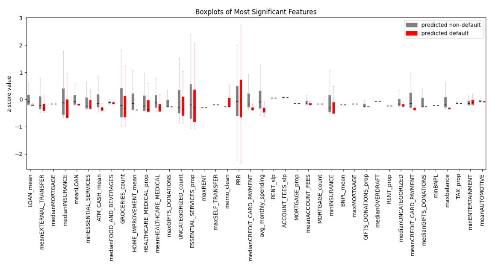
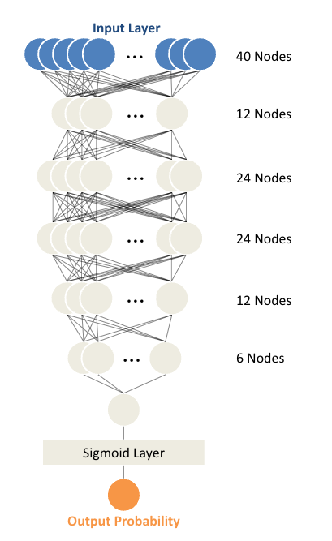

# Credit Scores for the Credit Invisible
Darren Jiang, Lakshmikethan Bethamcharla, Sheng Zhou, Victor Thai
 
Section: B18, Mentors: Brian Duke & Berk Ustun
  

### **What is a Credit Score, and Why Create a New Credit Score?** 
A credit score is a rating that represents your predicted credit behavior, such as paying a loan on time. Many financial institutes, such as banks, creditors, or government agencies use credit scores to make decisions on whether to offer you a mortgage, loan, or determine credit limits and interest rates.

While many factor impact your credit score, the primary system today requires building a credit history, which could take months to years of positive credit reports. As a result, people with limited or no established credit history (often called the "Credit Invisible") are generally unable to qualify for any loans. With the rise of banking transactions and the use of personal transaction accounts, we aim to use this data to further extrapolate a consumer's behavior.
  

### **Introduction** 
Our project's goal is to create a credit score for individuals. We split the work into two parts: categorizing transactions and building a risk prediction model. First, we cleaned up messy transaction descriptions and used methods such as BERT to accurately classify transactions into categories like groceries or bills. Next, we created features from people's transaction history, account balances, and estimated income. We then built models like linear regression and neural networks to analyze these features and predict someone's risk of defaulting on a loan.
  

### **Data** 
We have four datasets: inflows (money going into accounts), outflows (money going out of accounts), accounts (details on account types and balances), and consumer (information on loan applications and defaults). The inflows dataset has around 513,000 transactions and the outflows dataset has around 1.3 million transactions. The accounts dataset contains information on nearly 4,700 unique accounts. The consumer dataset has details on almost 2,000 consumers and whether they defaulted on their first loan payment. Your goal is to develop a better credit assessment system using the banking records, transaction data, and account values in these datasets.
  

### **Feature Creation and Selection** 

| Feature Name | Description |
| --- | --- |
| balance_summary_stats | min, max, and standard dev of balance a consumer has in any of their accounts |
| cumulative weighted default monthly avg | get sum of average weighted value of overdraft per month |
| category_summary_stats | mean, median, min, and max of spending in each category throughout dataset |
| disposable_income | amount remaining after combining all inflow and outflow transactions |
| avg_monthly_spending | average amount of money spent in a month |
| num_avg_monthly_purchases | average number of purchases in a month |
| avg_monthly_cat_spending | average amount of money spent in a month for each category |
| avg_monthly_cat_count | average amount of purchases in a month for each category |
| num_savings_transfer | number of times someone has pulled from savings account |
| insufficient_bal | boolean for whether a consumer has an account that is <= 0 at time of evaluation |
| num_accounts | total number of accounts a consumer has |
| monthly_cat_slope | slope of spending for each category |
| non_essential_ratio | proportion of spending done in non-essential vs essential categories |
| stand_balance_slope | slope of monthly balance |
| positive remaining ratio | amount of months where cash flow is positive out of all months in dataset for each consumer |
| credit ratio | maximum number of consecutive months in which a consumer pays of a loan |
| prop spending | percentage of total consumer spending for each category |
| overdraft freq | boolean value of users with more than 1 monthly overdraft transaction |

We  created over 200 distinct input features like balance summaries, category spending, disposable income, monthly averages, and spending ratios. Creating monthly features required splitting the data by year and month and using the median. We filtered to the most effective features for the final model to avoid overfitting. 

  

### **Models** 

#### Logisitic Regression  
We created a Logistic Regression model to serve as a baseline. we created a logistic regression classifier using standard scikit-learn functions. The initial maximum number of epochs was set to 100, but increasing it to 1000 did not significantly improve the model's performance.

#### Neural Net 

We trained a sequential neural network initially for 500 epochs with batch size 8, then reduced to 200 epochs with batch size 64 for faster training. The neural network has 5 hidden layers with sizes 12, 24, 24, 12, and 6. It takes in 40 features and outputs the probability of default through a sigmoid function. We optimized the threshold by testing different values on the validation set to maximize the ROC-AUC score. The model with the lowest validation loss during training is used as the final model.

  

### **Results** 

For classifying memos by category of credit card transactions, we utilized our cleaned data
with three different models to see which could perform the best.

| Memo Classification Model | Accuracy |
| --- | --- |
| BERT | 88% |
| Logistic Regression with TF-IDF | 97% |
| Decision Tree Classifier with TF-IDF | 98% |

When looking at the results for the risk-assessment models:

| Risk Assessment Model | ROC-AUC Score |
| --- | --- |
| Logistic Regression | 0.57778 |
| Sequential NN | 0.78500 |

  

### **Conclusion / Next steps** 
Throughout the project, we created additional features such as category spending summaries along with feature based statistics to give the models more insight into overall consumer behavior and risk. 

The models that we decided to use in our determination of how effective our features are included using a simple Logistic Regression model, along with a Sequential Neural Network. We decided to a model that is very straightforward just simply using previous classification outputs and another model that uses tensors / layers that would provide more granularity on our final output. After looking at both models, the neural network provided more accurate results but took longer to train. We used a  ROC-AUC score that measures how well the model can distinguish between default and non-default scenarios.

Based on our current work, we have been able to predict consumer default. The next step in creating a final credit score is to incorporate our own personal scaling to convert it to a marketable "score". Our group also aims to continue our next steps into looking at how to filter down our features to an even greater extent. It can be seen that a simpler model may not do as well as a complex model, but similarly amongst our features, a simple set of features would be more interpretable. This is a balance that our group would have to look deeper into. Given that we had more time on this project, we are interested in also looking further into extraneous factors such sa personal assets that could pose as a further way to create a credit scoring system. 

By further exploring those steps, this would create a model that encapsulates a whole vision of how a consumer behaves, generating greater granularity and accuracy into a predicted consumer credit score.
 

[Click here to find the Project Repo](https://github.com/JiaDarren/DSC_180A)